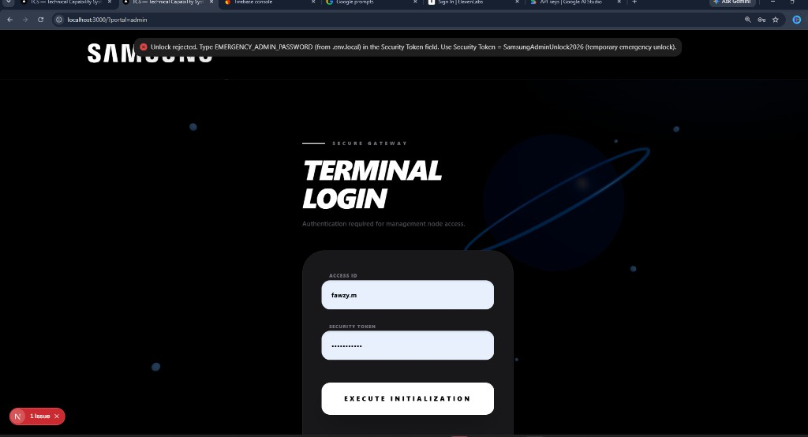
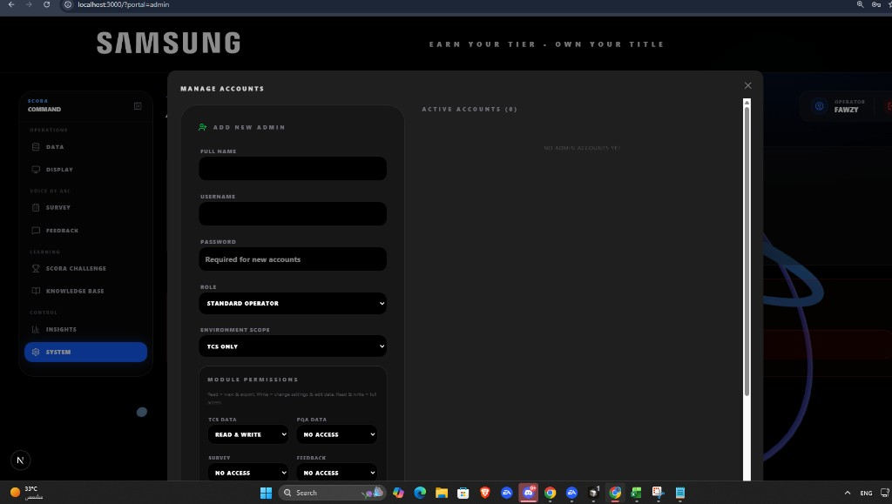
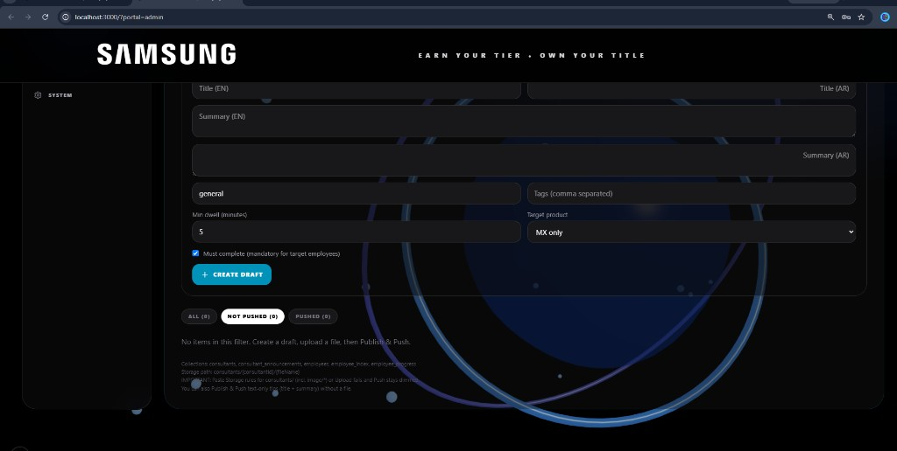
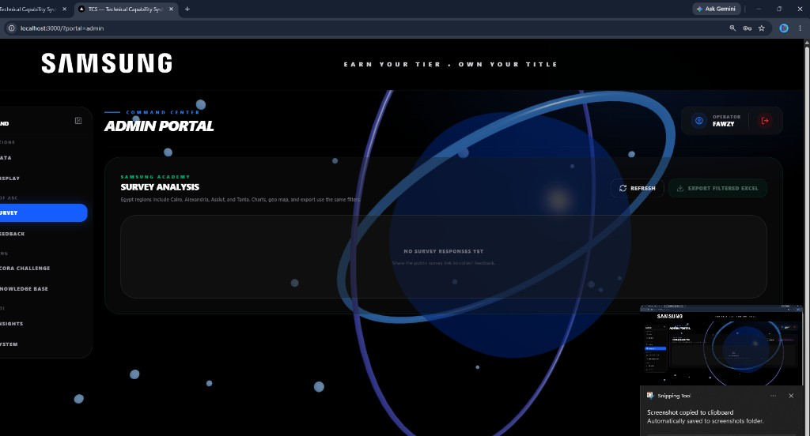
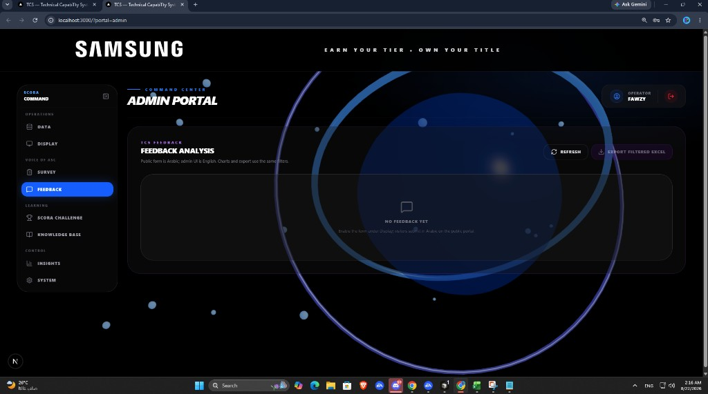
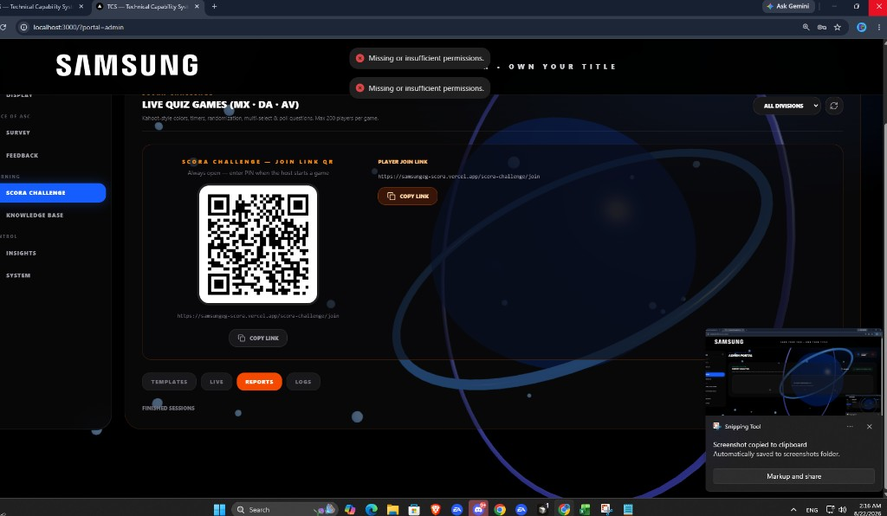
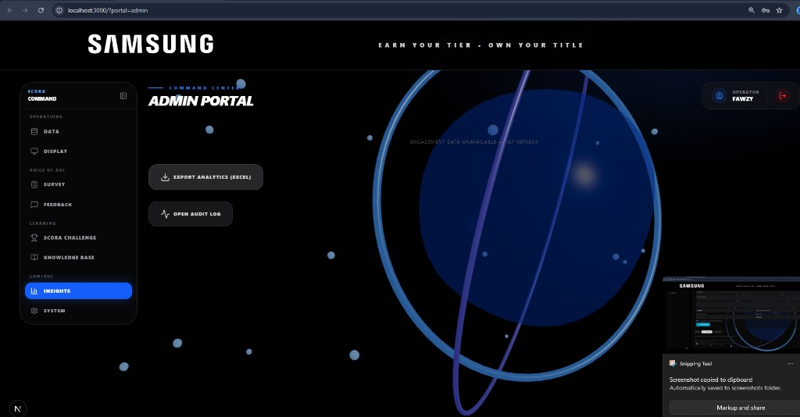

# SCORA Admin Portal Training Guide  
### Full walkthrough with screenshots for trainer-led sessions

**Audience:** Super Admins / Operators  
**URL:** `/?portal=admin` or `/admin`  
**Goal:** Train admins to log in, manage data, surveys, feedback, SCORA Challenge, Knowledge Base (technical tips), insights, and system/accounts.

---

## 0) Before training (trainer prep)

| Item | Status needed |
|---|---|
| Firebase **Email/Password** enabled | Required for admin Auth login |
| `FIREBASE_SERVICE_ACCOUNT_JSON` in `.env.local` | Required to create admins from the app |
| Firestore rules published from repo | Required so Survey / Feedback / Reports / Insights load |
| Sample tip + one employee account | For Knowledge Base live demo |

---

## 1) Admin login

1. Open **`http://localhost:3000/?portal=admin`** (or production admin URL).
2. You should see **TERMINAL LOGIN** (Secure Gateway).

3. Enter:
   - **Access ID:** email (e.g. `fawzymaherahmed@gmail.com`) **or** username (`fawzy.m`)
   - **Security Token:** password
4. Click **Execute Initialization**.

> Emergency unlock was removed. Login must use Firebase Auth (or legacy username only if Firestore admins are readable).

After login you enter **Command Center** with the left sidebar.

---

## 2) Portal map (sidebar)

| Section | Tab | Purpose |
|---|---|---|
| Operations | **DATA** | TCS / PQA engineer & center data, Excel import |
| Operations | **DISPLAY** | Public toggles (survey popup, feedback promo, winners, etc.) |
| Voice of ASC | **SURVEY** | Samsung Academy survey analytics + Excel export |
| Voice of ASC | **FEEDBACK** | Arabic feedback analytics + Excel export |
| Learning | **SCORA CHALLENGE** | Quiz templates, live host, reports, logs |
| Learning | **KNOWLEDGE BASE** | Technical tips / consultants for employees |
| Control | **INSIGHTS** | Engagement analytics + audit log |
| Control | **SYSTEM** | Admin accounts & permissions |

---

## 3) SYSTEM — Manage Accounts

Open **SYSTEM**.

### Add a new admin

Fill:

1. Full name  
2. Username  
3. **Email (Firebase Auth)** ← required  
4. Password  
5. Role (Standard operator / Super admin)  
6. Environment scope + module permissions  

Click **Add admin**.

> Creating users needs **Admin SDK** (`FIREBASE_SERVICE_ACCOUNT_JSON`). Without it, Add Admin fails.

### Active accounts

- Edit access / permissions  
- Delete (not yourself)  
- Jimmy / George appear only after Firestore `admins` list is readable (rules published)

---

## 4) KNOWLEDGE BASE — Technical tips for employees

Open **Knowledge Base**.

This is where you create **technical tips** that show in employee **My Knowledge**.

### Create a tip (draft)

| Field | Meaning |
|---|---|
| Title EN / AR | Tip name |
| Summary EN / AR | Short description |
| Tags | Search / filter |
| **Min dwell (minutes)** | Required reading time (e.g. `5`) |
| Target product | MX only / CE / etc. |
| **Must complete** | Mandatory for target employees |

Click **+ CREATE DRAFT**.

### Upload & push

1. Upload file(s) if needed (PDF/image).  
2. Filter **Not pushed** → select tip.  
3. **Publish & Push** to employees.  
4. Employees then see it under **Pending**.

### Why Min dwell matters (training talking point)

- Employee must keep the tip open for the required minutes (**Active time**).  
- Progress can **resume** if they leave and return — they should not always restart from zero.  
- Set dwell high enough for real reading, not so high that people abandon.

### Trainer snapshot checklist (Knowledge Base)

Capture for training deck:

1. Empty create form  
2. Draft tip with Min dwell = 5  
3. Pushed tip in **ALL / PUSHED**  
4. Employee My Knowledge showing the same tip as **Pending** (`snaps/01-employee-dashboard-knowledge.png`)

---

## 5) SURVEY — Samsung Academy Survey Analysis

Open **Survey**.

| Control | Use |
|---|---|
| Filters | Region / product / dates (as available) |
| **Refresh** | Reload responses |
| **Export Filtered Excel** | Download for offline review |

Enable the public survey from **Display** if the form is off.

If you see empty charts + permissions errors → publish Firestore rules (admin read).

---

## 6) FEEDBACK — TCS Feedback Analysis

Open **Feedback**.

- Public form is Arabic; admin UI is English.  
- Use **Refresh** / **Export Filtered Excel**.  
- Enable the form under **Display** if visitors cannot submit.

---

## 7) SCORA CHALLENGE — Live quiz & reports

Open **SCORA Challenge**.

Tabs:

| Tab | Purpose |
|---|---|
| Templates | Build / edit quiz templates |
| Live | Host live game + QR / join link |
| **Reports** | Finished sessions |
| Logs | Quiz activity logs |

**Training demo:**

1. Create or pick a template  
2. Start Live session → show QR / join link  
3. After finish → open **Reports** for scores  

If **Reports** shows “Missing or insufficient permissions”, publish rules / ensure admin Auth claims or owner email rule.

---

## 8) INSIGHTS — Engagement & audit

Open **Insights**.

| Button | Use |
|---|---|
| Export Analytics (Excel) | Visitor engagement export |
| Open Audit Log | Admin action history |

Tap **Refresh** if engagement data is unavailable.

---

## 9) DATA & DISPLAY (quick)

### DATA
- Import / maintain TCS & PQA registries (Excel).  
- Use correct division (MX / DA / AV) and role tabs for MX.

### DISPLAY
- Toggle Academy Survey popup  
- Toggle Feedback promo  
- Dashboard winners / public presentation options  

(Trainers: show Display toggles before asking visitors to submit survey/feedback.)

---

## 10) Admin login vs Employee login (don’t mix)

| | Admin portal | Employee (GSPN) |
|---|---|---|
| URL | `/?portal=admin` | Gateway **Sign in** |
| ID | Admin email / username | GSPN or email |
| Purpose | Manage system | My Knowledge / tips |
| Screenshot | `12-admin-login.png` | `14-employee-login-modal.png` |

---

## 11) Suggested admin training agenda (45–60 min)

| Time | Topic | Snap |
|---|---|---|
| 5 min | Login & sidebar map | `12-admin-login.png` |
| 10 min | SYSTEM — add admin + roles | `06-admin-manage-accounts.png` |
| 15 min | Knowledge Base — create tip, Min dwell, Push | `10-admin-knowledge-base.png` + `01-…` |
| 5 min | Survey | `08-admin-survey.png` |
| 5 min | Feedback | `07-admin-feedback.png` |
| 10 min | SCORA Challenge Live + Reports | `09-admin-scora-reports.png` |
| 5 min | Insights | `11-admin-insights.png` |

---

## 12) Admin troubleshooting

| Symptom | Likely cause | Fix |
|---|---|---|
| Empty Survey / Feedback / Insights | Firestore `isAdmin()` blocked | Publish updated `firestore.rules` |
| SCORA Reports permission toast | Same | Publish rules; re-login |
| Can’t Add Admin | No service account | Set `FIREBASE_SERVICE_ACCOUNT_JSON` |
| Manage Accounts shows only you | `admins` list unreadable / empty | Publish rules; migrate Jimmy/George |
| Employee can’t Sign up | `employee_index` rules | Publish rules with public `get` on index |

---

## 13) Trainer checklist

- [ ] Admin can log in without emergency unlock  
- [ ] SYSTEM shows accounts  
- [ ] Can create tip with Min dwell and Push  
- [ ] Employee sees tip in Pending  
- [ ] Survey / Feedback / Insights load (not permission-denied)  
- [ ] SCORA Reports opens finished sessions  
- [ ] Training deck includes snaps from `docs/training/snaps/`  

---

*Document location:* `docs/training/ADMIN_GUIDE.md`  
*Screenshots:* `docs/training/snaps/`  
*Pair with:* `docs/training/USER_GUIDE.md`
