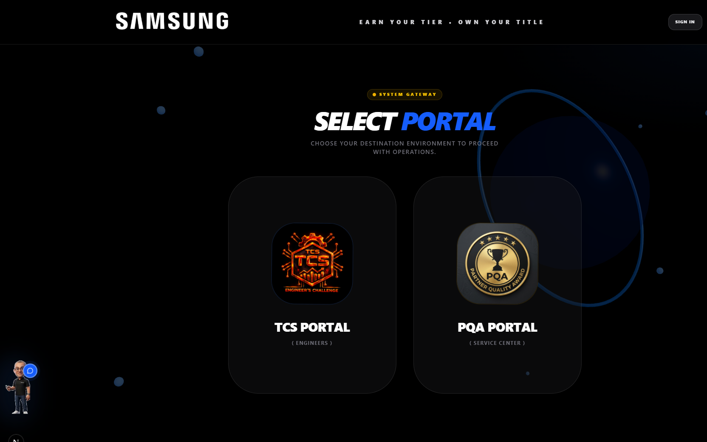
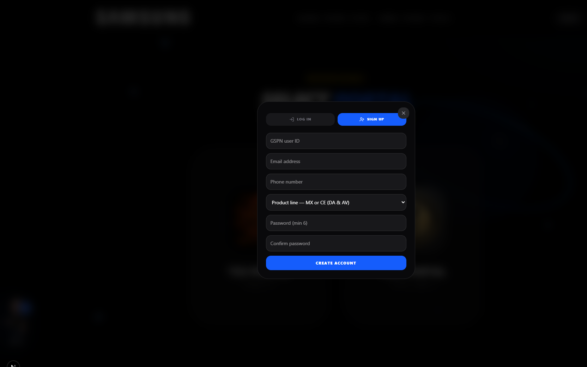
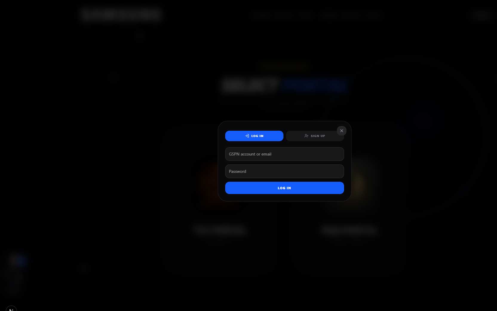
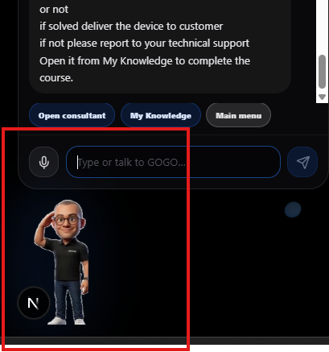
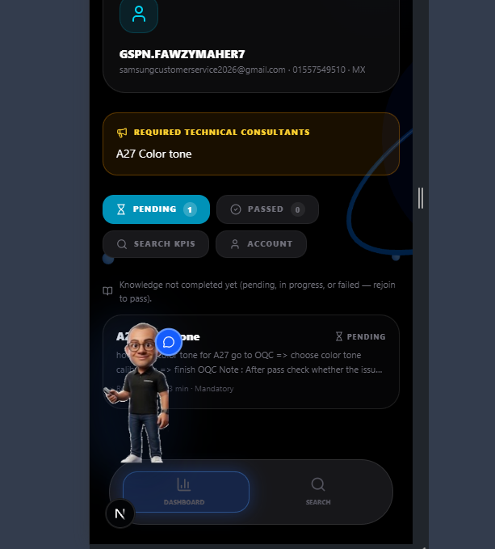

# SCORA User Training Guide  
### Login · Profile · Technical Tips · Reading Time · Snapshots

**Audience:** Engineers / ASC staff (GSPN accounts)  
**App:** Samsung EG SCORA (TCS / PQA)  
**Goal:** After this training you can sign in, open My Knowledge, complete technical tips, and understand the required reading time (so you do **not** have to start over).

---

## 1) Open the app (Gateway)

1. Open the SCORA website (or `http://localhost:3000` in training).
2. You land on **System Gateway → Select Portal**.

| What you see | What to do |
|---|---|
| **SIGN IN** (top right) | Employee / GSPN login & signup |
| **TCS Portal** | Engineer leaderboard & TCS tools |
| **PQA Portal** | Service center / PQA tools |
| **GOGO** (bottom left) | Tap the character to open the assistant chat (chat does **not** open by itself) |

---

## 2) Create account (first time)

1. Click **SIGN IN**.
2. Open the **SIGN UP** tab.
3. Fill fields **in this order**:

| # | Field | Example |
|---|---|---|
| 1 | **GSPN user ID** | `gsp.fawzymaher7` |
| 2 | **Email address** | your work email |
| 3 | **Phone number** | mobile number |
| 4 | **Product line** | MX **or** CE (DA & AV) |
| 5 | **Password** | min 6 characters |
| 6 | **Confirm password** | same password |

4. Click **CREATE ACCOUNT**.

> If you see “Missing or insufficient permissions”, ask an admin to publish updated Firestore rules. Auth (Email/Password) must be enabled in Firebase.

---

## 3) Log in (returning users)

1. Click **SIGN IN**.
2. Stay on **LOG IN**.
3. Enter **GSPN user ID or email** + **password**.
4. Click **LOG IN**.

After login, your name/GSPN appears in the header profile area.

---

## 4) Open your profile & My Knowledge

### A) From GOGO (recommended)

1. Tap **GOGO**.
2. Use chips such as **My Knowledge** / **Open consultant**.
3. If you are not logged in, Sign in appears first — then My Knowledge opens.

### B) From the header

1. Use the profile / **Sign in** control (top right).
2. After login, open **My Knowledge** (employee dashboard).

On **My Knowledge** you will see:

- Your profile card (GSPN, email, phone, product line)
- **Required technical consultants** (mandatory tips)
- Tabs: **Pending** · **Passed** · **Search KPIs** · **Account**

---

## 5) Technical tips (consultants) — how to complete them

1. Open a tip card (example: **A27 Color tone**).
2. Read the content / open attached files.
3. Watch the **Active time** timer at the top:

   `Active time 02:15 / 05:00`

4. Stay on the page until the required time is reached.
5. Click **Complete** (or the finish action) when available.

### Required reading time (Min dwell)

| Concept | Meaning |
|---|---|
| **Min dwell** | Minimum active reading time set by admin (often 5 minutes) |
| **Active time** | Time counted while you keep the tip open |
| **Must complete** | Mandatory tip for your product line / target group |

**Important — avoiding re-enter from zero**

- If you leave and come back **before finishing**, the app tries to **resume** your last open attempt (dwell + clicks), so you usually **do not restart from 00:00**.
- If you leave too early and force-finish, you may get a fail message with time remaining — reopen and finish the remaining time.
- Keep the tip tab open; switching away for long periods may pause progress depending on focus rules.

**Training tip for trainers:** take a snapshot of the timer bar and the tip card for each mandatory topic (see section 7).

---

## 6) Using GOGO for tips & navigation

| Action | Result |
|---|---|
| Tap GOGO | Opens chat |
| Close / minimize chat | GOGO stays as full-body helper on portal pages |
| Chip: **My Knowledge** | Opens employee dashboard (after login) |
| Chip: **Open consultant** | Opens the related tip if announced |

GOGO is **hidden** on My Knowledge / tip viewer so content stays readable.

---

## 7) Snapshots for easy training review

Use these snaps (or capture your own) when training a new engineer:

| Snap | File | Use in training |
|---|---|---|
| Gateway | `snaps/13-gateway-select-portal.png` | “Where do we start?” |
| Sign up | `snaps/15-employee-signup-modal.png` | First-time account |
| Log in | `snaps/14-employee-login-modal.png` | Daily access |
| My Knowledge | `snaps/01-employee-dashboard-knowledge.png` | Profile + pending tips |
| GOGO chat | `snaps/03-gogo-chat-full.png` | How to ask for help |
| Tip peek sample | `snaps/04-gogo-peek-sample.png` | Optional GOGO states |

**Suggested live demo order (15–20 min):**

1. Gateway → Sign up / Log in  
2. My Knowledge → show Pending tip  
3. Open tip → show Active time → wait or skip in demo if trainer account  
4. Complete tip → show Passed tab  
5. Optional: ask GOGO “My Knowledge”

---

## 8) Quick troubleshooting (users)

| Problem | What to try |
|---|---|
| Can’t create account | Confirm Email/Password Auth is on; ask admin about Firestore rules |
| GSPN not found on login | Use the **email** you signed up with, or Sign up first |
| Tip won’t complete | Stay until Active time ≥ required time |
| Lost progress | Re-open the same tip — progress often resumes automatically |
| Can’t see tip text | Make sure you are inside My Knowledge (GOGO is hidden there) |

---

## 9) Checklist — end of training

- [ ] I can open the Gateway  
- [ ] I can Sign up / Log in with GSPN + email  
- [ ] I can open **My Knowledge**  
- [ ] I understand **Pending / Passed**  
- [ ] I know **Active time / Min dwell** and why I must keep the tip open  
- [ ] I know progress can **resume** so I don’t always restart  
- [ ] I can open GOGO and use **My Knowledge** chip  

---

*Document location:* `docs/training/USER_GUIDE.md`  
*Screenshots:* `docs/training/snaps/`
